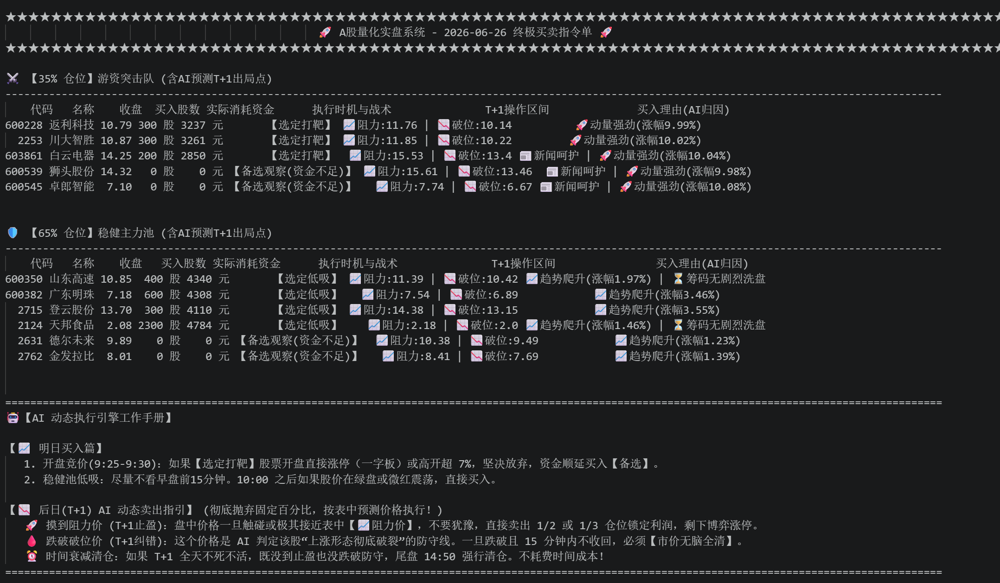

# 🚀 Auto-Quant-Engine: 跨域融合量化决策系统

基于 **大语言模型 (LLM) 结构化特征提取** 与 **LightGBM 机器学习预判** 的端到端异步高并发量化交易系统。

该项目出于个人对 AI 工程化落地的探索热情开发，未采用常规的“调包回测”路线，而是自底向上构建了具备**容错、高并发与网络自适应隔离**的数据流转管道。系统自动爬取并缝合 K 线数据与文本舆情，输入至预测引擎，最终输出含具体仓位管控的 T+1 实盘指令。

## 🌟 核心工程亮点 (Engineering Highlights)

1. **防死锁与高并发调度：**
   - 针对海量网络 I/O 请求瓶颈，基于 `ThreadPoolExecutor` 设计了动态并发池（最高 32 线程）。
   - 注入 `socket.setdefaulttimeout(15.0)` 与文件级断点续传机制，彻底解决第三方数据接口引发的无限期挂起（死锁）顽疾。
2. **LLM 结构化降维管道 (Prompt Engineering)：**
   - 摈弃传统的简单情感词典，利用精确的 System Prompt 约束 Gemini 接口进行高维文本降维。强制 LLM 剥离情绪化表达，并输出严格的 JSON 结构化因子（包含 `sentiment_score` 情绪分与 `is_trap` 隐蔽风险预警）。
3. **网络上下文自适应隔离 (Context Manager)：**
   - 创新编写 `BypassProxyContext` 上下文管理器，完美隔离并解决国内金融 API 与海外大模型 API 在同一进程下因环境变量引起的 HTTP 代理劫持与冲突问题。
4. **决策融合模型：**
   - 将 LLM 提取的文本特征与数十项量价技术特征（动量、突破、乖离率等）无缝融合，利用 LightGBM 决策树计算期望收益率，并叠加小资金约束算法输出最终买卖点位。

## 📁 目录结构与隔离规范

项目采用了良好的数据与代码隔离架构，所有动态生成的数据文件与模型将被安全地限定在 `data/` 目录中。

```text
Auto-Quant-Engine/
├── quant_engine.py       # 系统核心引擎代码
├── requirements.txt      # 依赖环境配置
├── .gitignore            # 版本控制忽略清单
├── .env.example          # 环境变量配置模板
└── README.md             # 项目说明文档
```

## 🛠️ 快速上手 (Quick Start)
1. 克隆代码与安装依赖
    ```Bash
    git clone https://github.com/你的用户名/Auto-Quant-Engine.git
    cd Auto-Quant-Engine
    pip install -r requirements.txt
    ```

2. 配置环境变量 (API Key 安全注入)
    系统采用环境变量机制保护秘钥安全，严禁硬编码。在终端中执行：
    ```Bash
    # Windows (CMD)
    set GEMINI_API_KEY=你的_google_gemini_api_key
    # Linux / Mac
    export GEMINI_API_KEY="你的_google_gemini_api_key"
    ```

3. 启动引擎
    ```Bash
    python quant_engine.py
    ```
4. 运行效果展示
   


## ⚠️ 免责声明 (Disclaimer)
本项目仅作为计算机软件工程、大模型(LLM)应用以及机器学习技术的个人探索与学术交流。项目生成的任何“预测”、“指令”或“决策”均不构成真实的投资建议。股市有风险，量化需谨慎。

